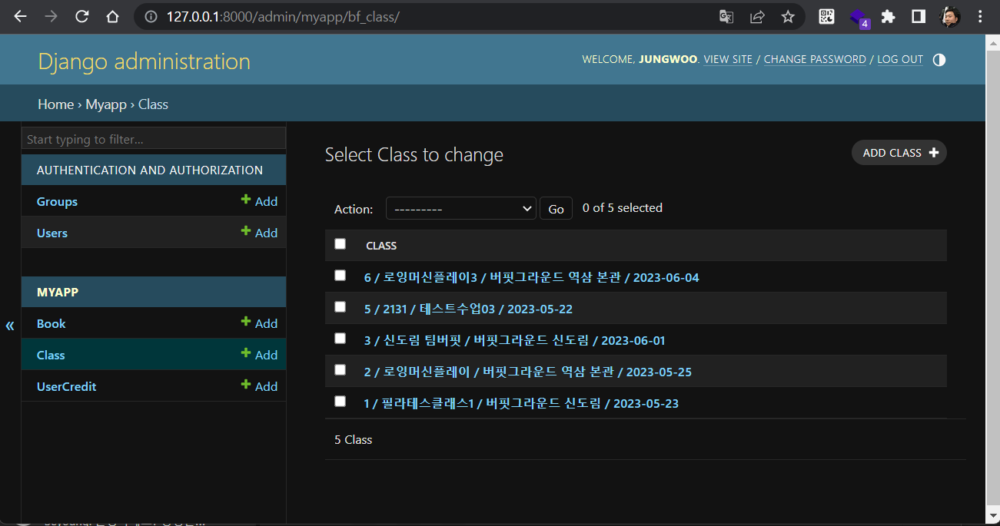
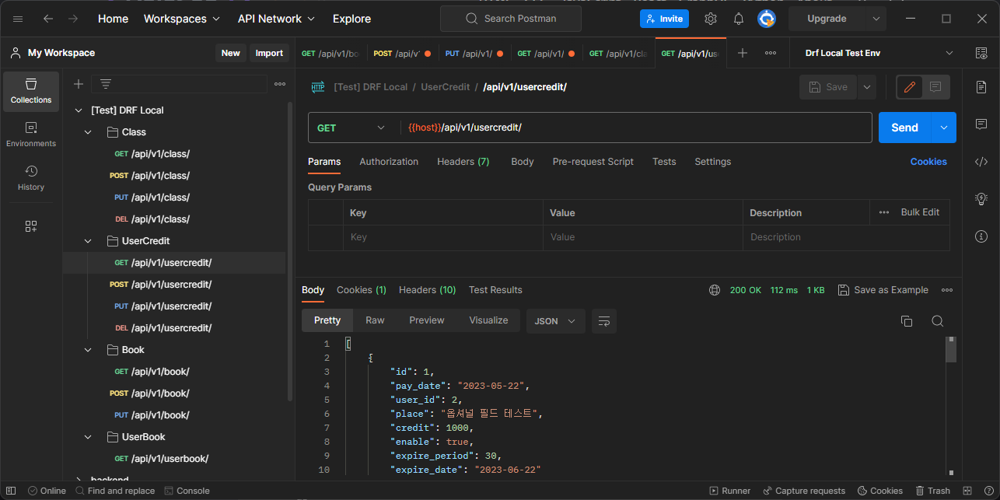
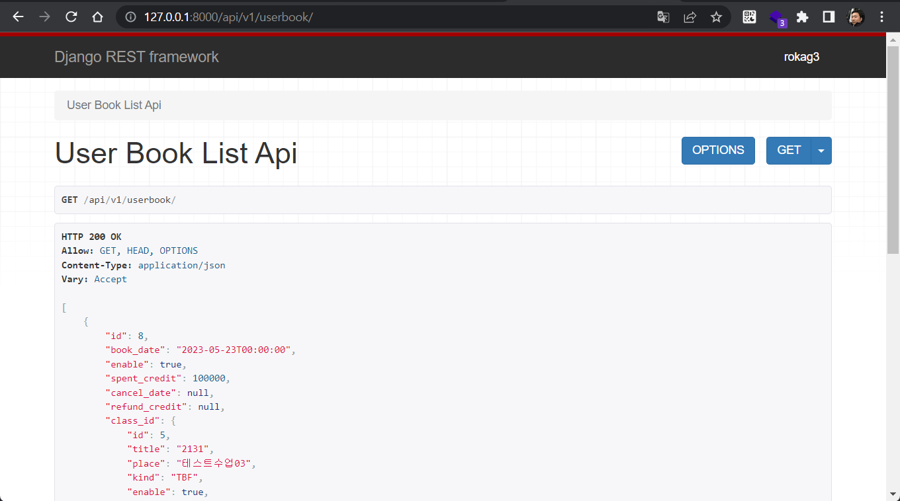

# Django with DRF (Django Rest Framework) practice project

- Django project name: DrfApiApp

- Django app name: myapp

- DB: PostgreSQL 15 
>계정: postgres / `????`

※ DrfApiApp/settings.py > DATABASES > PASSWORD 키를 기록해놓은 my_secret.py 파일은 GitIgnore 적용함.

- Django admin 계정: rokag3 / `????`

## 전체 모델 구성

- Profile: Django Auth_User 와 1:1 매칭되는 커스텀 모델

- Class(bf_Class): 수업 모델

- UserCredit(bf_UserCredit): 크레딧 구매 모델

- Book(bf_Book): 수업예약 모델

## 각 기능별 구현 내용

- 수업 셋팅하기: Django-admin에서 수업(Class) CRUD 구현

- 크레딧 구매하기: UserCredit CRUD 구현 (Postman에서 요청/응답)
models.py > bf_UserCredit 클래스 정의 부분에서 computed_property 활용하여 구매한 크레딧 금액에 따라 사용 가능 기간 다르게 적용.

- 수업 예약하기: Book CRUD 구현 (Postman에서 요청/응답)
views.py > BookListAPI 에서, 같은 수업(날짜, 시간, 종류, 장소)에 같은 유저는 중복 예약 불가하도록 구현.

- 수업 예약 리스트 보기: Book, Class, Profile 모델을 join한 형태이고 기간 (book_date 컬럼 기준)으로 검색할 수 있도록 API 제공. (Postman에서 요청/응답)
> {host}/api/v1/userbook/

- 수업 예약 Admin 보기: Django-admin에서 Book 전체 조회 
-> admin.py > bf_BookAdmin 클래스에서 search_fields 를 설정하여서 phone_number로 검색할 수 있도록 하는 부분 테스트 실패하여 반영하지 못하였습니다.

## 돌아보기

1. models.py 안에 여러 class들을 선언, 각 속성들이 DB 테이블에 어떻게 반영되는지 여러가지 방법으로 테스트. 잼있었다.
그러나 makemigrations & mirgate 하는 과정에서 에러가 속출. DRF의 편리함이 있는 반면에, 종속적인 제약들도 발생함.

1. urls.py에서 router register 통해서도 viewset을 라우팅할 수 있다는 사실. -> 추후 테스트 필요

1. views.py 는 Controller와 같은 개념. 2가지 패턴 (클래스 기반, 함수 기반) 으로 구현 가능하더라.
    - @api_view: 함수 기반 보기 작업을 위한 데코레이터
    - APIView: 클래스 기반 보기 작업을 위한 클래스

1. Serializers.py에서 여러 serializer 들을 결합하여 직렬화 해주는 부분 잼있었다.

1. 다음에는 Django Queue (like Celery)를 테스트 해보고 싶다.

---
`eof`